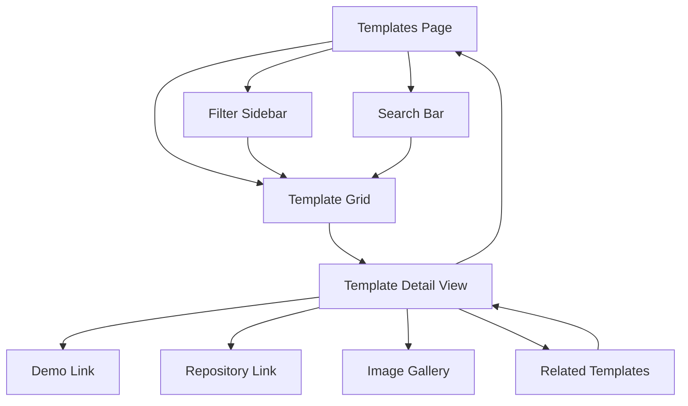

# Igniter.js Templates Section - Product Requirements Document

## 1. Product Overview

The Templates section will provide a comprehensive marketplace for Igniter.js starter templates, featuring a filterable sidebar interface and template showcase inspired by Vercel's templates page design but adapted to Igniter.js's existing aesthetic and component architecture.

This feature enables developers to quickly discover, preview, and deploy production-ready templates for various use cases including SaaS applications, e-commerce platforms, blogs, and API services. The section facilitates community contributions through a simple JSON-based data structure that allows easy template additions via repository edits.

## 2. Core Features

### 2.1 User Roles

| Role         | Registration Method      | Core Permissions                                                      |
| ------------ | ------------------------ | --------------------------------------------------------------------- |
| Default User | No registration required | Browse templates, view details, access demo links, visit repositories |
| Contributors | GitHub repository access | Add/edit templates via JSON file modifications and pull requests      |

### 2.2 Feature Module

Our templates section consists of the following main pages:

1. **Templates Page**: Left sidebar with multi-select filters, main template grid feed, search functionality
2. **Template Detail View**: Individual template showcase with demo links, repository access, image gallery, markdown description, and related templates
3. **Template Management**: JSON-based data structure for easy community contributions

### 2.3 Page Details

| Page Name            | Module Name           | Feature description                                                                                                                                                                                    |
| -------------------- | --------------------- | ------------------------------------------------------------------------------------------------------------------------------------------------------------------------------------------------------ |
| Templates Page       | Filter Sidebar        | Multi-select filters for frameworks (Next.js, React, Node.js), use cases (SaaS, E-commerce, Blog, API), categories (Starter, Advanced, Full-stack). Clear all filters option and active filter display |
| Templates Page       | Search Bar            | Real-time search functionality across template names, descriptions, and tags with debounced input                                                                                                      |
| Templates Page       | Template Grid         | Responsive card layout displaying template image, name, author, short description, framework badges, and quick action buttons                                                                          |
| Templates Page       | Template Card         | Template preview image, title, author information, brief description, framework/category badges, star count, and click-to-view action                                                                  |
| Template Detail View | Hero Section          | Large template preview image, title, author, description, demo button (if available), repository link, and deployment button                                                                           |
| Template Detail View | Image Gallery         | Carousel or grid view of multiple template screenshots with zoom functionality                                                                                                                         |
| Template Detail View | Description Panel     | Markdown-rendered detailed description with syntax highlighting for code blocks                                                                                                                        |
| Template Detail View | Related Templates     | Horizontal scrollable list of related templates with quick navigation                                                                                                                                  |
| Template Detail View | Technical Details     | Framework version, dependencies, features list, and setup requirements                                                                                                                                 |
| Template Management  | Data Structure        | JSON-based template definitions with TypeScript interfaces for type safety and validation                                                                                                              |
| Template Management  | Contribution Workflow | Clear documentation for adding templates, validation scripts, and pull request guidelines                                                                                                              |

## 3. Core Process

**Default User Flow:**

1. User navigates to Templates page from main navigation
2. User browses available templates in grid layout
3. User applies filters by framework, use case, or category to narrow results
4. User searches for specific templates using search bar
5. User clicks on template card to view detailed information
6. User accesses demo link (if available) or repository link
7. User can view related templates and navigate between them
8. User can return to main templates grid or explore other sections

**Contributor Flow:**

1. Contributor forks the Igniter.js repository
2. Contributor edits the templates JSON file with new template data
3. Contributor adds template images to designated assets folder
4. Contributor runs validation script to ensure data integrity
5. Contributor submits pull request with template addition
6. Maintainers review and merge approved templates



## 4. User Interface Design

### 4.1 Design Style

* **Primary Colors**: Consistent with Igniter.js theme using CSS custom properties (--foreground, --background, --border)

* **Secondary Colors**: Muted tones for secondary text (--muted-foreground) and accent colors (--accent)

* **Button Style**: Rounded corners (--radius: 0.65rem), consistent with existing UI components

* **Typography**: GeistSans and GeistMono fonts matching the existing design system

* **Layout Style**: Card-based design with consistent border styling (border-border), grid layouts with proper spacing

* **Icons**: Lucide React icons for consistency with existing components

* **Animation**: Framer Motion animations matching existing page transitions and hover effects

### 4.2 Page Design Overview

| Page Name            | Module Name       | UI Elements                                                                                                                                                               |
| -------------------- | ----------------- | ------------------------------------------------------------------------------------------------------------------------------------------------------------------------- |
| Templates Page       | Filter Sidebar    | Fixed left sidebar (w-64) with white/dark background, border-r border-border, checkbox groups with custom styling, clear filters button, collapsible sections             |
| Templates Page       | Template Grid     | Responsive grid (grid-cols-1 md:grid-cols-2 lg:grid-cols-3), gap-6 spacing, Card components with hover effects, image aspect-ratio-video, badge components for categories |
| Templates Page       | Search Bar        | Full-width input with search icon, debounced functionality, placeholder text, focus states matching existing form components                                              |
| Template Detail View | Hero Section      | Full-width container with max-w-7xl, grid layout for image and details, Button components for actions, responsive image sizing                                            |
| Template Detail View | Image Gallery     | Carousel with navigation dots, modal overlay for full-size viewing, responsive grid fallback                                                                              |
| Template Detail View | Description Panel | Prose styling for markdown content, syntax highlighting for code blocks, proper spacing and typography hierarchy                                                          |
| Template Detail View | Related Templates | Horizontal scroll container, template cards with reduced size, smooth scrolling behavior                                                                                  |

### 4.3 Responsiveness

The templates section is designed mobile-first with desktop enhancement:

* **Mobile (< 768px)**: Single column layout, collapsible sidebar as drawer, stacked template cards

* **Tablet (768px - 1024px)**: Two-column template grid, sidebar remains visible

* **Desktop (> 1024px)**: Three-column template grid, fixed sidebar, optimal spacing

* **Touch Optimization**: Larger touch targets for mobile, swipe gestures for image gallery

## 5. Data Structure & Technical Implementation

### 5.1 TypeScript Interface

```typescript
interface Template {
  id: string;
  name: string;
  slug: string;
  author: {
    name: string;
    avatar?: string;
    github?: string;
  };
  description: string;
  longDescription: string; // Markdown content
  images: {
    hero: string;
    gallery: string[];
    thumbnail: string;
  };
  demoLink?: string;
  repositoryLink: string;
  deployLink?: string;
  framework: Framework[];
  useCase: UseCase[];
  categories: Category[];
  tags: string[];
  features: string[];
  relatedTemplates: string[]; // Array of template IDs
  createdAt: string;
  updatedAt: string;
  stars?: number;
  downloads?: number;
  difficulty: 'Beginner' | 'Intermediate' | 'Advanced';
  requirements: {
    node?: string;
    npm?: string;
    dependencies: string[];
  };
}

type Framework = 'Next.js' | 'React' | 'Node.js' | 'Express' | 'Bun' | 'Deno' | 'TanStack Start';
type UseCase = 'SaaS' | 'E-commerce' | 'Blog' | 'API' | 'Dashboard' | 'Landing Page' | 'Portfolio';
type Category = 'Starter' | 'Advanced' | 'Full-stack' | 'Frontend' | 'Backend' | 'Utility';
```

### 5.2 Component Architecture

```typescript
// Main Templates Page Component
interface TemplatesPageProps {
  templates: Template[];
  frameworks: Framework[];
  useCases: UseCase[];
  categories: Category[];
}

// Filter Sidebar Component
interface FilterSidebarProps {
  frameworks: Framework[];
  useCases: UseCase[];
  categories: Category[];
  activeFilters: FilterState;
  onFilterChange: (filters: FilterState) => void;
  onClearFilters: () => void;
}

// Template Card Component
interface TemplateCardProps {
  template: Template;
  onClick: (template: Template) => void;
}

// Template Detail Modal Component
interface TemplateDetailProps {
  template: Template;
  relatedTemplates: Template[];
  isOpen: boolean;
  onClose: () => void;
}
```

## 6. Community Contribution Workflow

### 6.1 Adding New Templates

1. **Fork Repository**: Contributors fork the main Igniter.js repository
2. **Edit Templates Data**: Modify `/apps/www/src/data/templates.json` with new template entry
3. **Add Assets**: Upload template images to `/apps/www/public/templates/[template-slug]/`
4. **Validate Data**: Run `npm run validate-templates` to check data integrity
5. **Submit PR**: Create pull request with template addition and required documentation

### 6.2 Template Submission Guidelines

* **Required Fields**: All template fields must be completed except optional ones (demoLink, deployLink)

* **Image Requirements**: Hero image (1200x630px), thumbnail (400x225px), gallery images (min 800px width)

* **Repository Standards**: Public GitHub repository with README, proper documentation, and working deployment

* **Quality Standards**: Templates must be production-ready, well-documented, and follow best practices

### 6.3 Validation & Quality Assurance

* **Automated Validation**: JSON schema validation for required fields and data types

* **Image Optimization**: Automated image compression and format validation

* **Link Verification**: Automated checking of repository and demo links

* **Manual Review**: Maintainer review for code quality, documentation, and user experience

## 7. Implementation Priority

### Phase 1 (MVP)

* Basic templates page with grid layout

* Filter sidebar with framework and use case filters

* Template detail modal with essential information

* JSON data structure and initial template set

### Phase 2 (Enhanced)

* Search functionality

* Image gallery with carousel

* Related templates section

* Contribution documentation and validation scripts

### Phase 3 (Advanced)

* Advanced filtering options

* Template analytics (views, downloads)

* User favorites and bookmarking

* Template rating and review system

## 8. Success Metrics

* **User Engagement**: Template page views, time spent browsing, click-through rates to repositories

* **Community Growth**: Number of community-contributed templates, pull request frequency

* **Developer Adoption**: Template deployment rates, demo link usage, repository stars

* **Content Quality**: Template diversity across frameworks and use cases, user feedback scores

