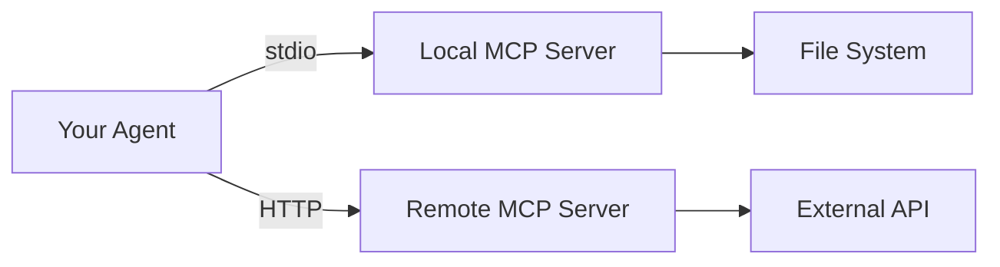

## MCP Integration

The **Model Context Protocol (MCP)** allows agents to discover and use tools from external servers at runtime. `@igniter-js/agents` supports both **stdio** (local process) and **HTTP** (remote server) transports.

---

## What is MCP?

MCP is an open protocol that standardizes how AI applications connect to external tool providers. An MCP server exposes tools — the agent discovers them at startup and can invoke them just like custom tools.



<Callout type="info">
  MCP tools are discovered at runtime when `agent.start()` is called. The agent doesn't need to know about them at build time.
</Callout>

---

## Installation

MCP support requires additional dependencies:

```bash
npm install @ai-sdk/mcp @modelcontextprotocol/sdk
```

---

## MCP Client Builder

### Stdio Transport (Local Process)

Spawns a local process and communicates via stdin/stdout:

```typescript
import { IgniterAgentMCPClient } from '@igniter-js/agents'

const filesystemMCP = IgniterAgentMCPClient
  .create('filesystem')
  .withType('stdio')
  .withCommand('npx')
  .withArgs([
    '-y',
    '@modelcontextprotocol/server-filesystem',
    '/home/user/workspace',
  ])
  .withEnv({
    DEBUG: 'mcp:*',
    HOME: process.env.HOME!,
  })
  .build()
```

### HTTP Transport (Remote Server)

Connects to a remote MCP server over HTTP/HTTPS:

```typescript
const remoteMCP = IgniterAgentMCPClient
  .create('opencode')
  .withType('http')
  .withURL('https://sandbox.example.com/mcp')
  .withHeaders({
    'Authorization': `Bearer ${process.env.MCP_API_KEY}`,
    'Content-Type': 'application/json',
  })
  .build()
```

---

## MCP Client Builder API

### Common Methods

| Method | Description |
|--------|-------------|
| `.create(name)` | Creates a new MCP client builder with a unique name |
| `.withType('stdio' \| 'http')` | Sets the transport type (required) |
| `.withName(name)` | Renames the configuration |
| `.build()` | Returns the built MCP config |

### Stdio-Specific Methods

| Method | Description |
|--------|-------------|
| `.withCommand(cmd)` | The command to execute (e.g., `npx`, `node`, `python`) |
| `.withArgs(args)` | Command-line arguments array |
| `.withEnv(env)` | Environment variables record |

### HTTP-Specific Methods

| Method | Description |
|--------|-------------|
| `.withURL(url)` | The MCP server endpoint URL |
| `.withHeaders(headers)` | HTTP headers record (auth, content-type, etc.) |

---

## Registering MCP Clients

Use `.addMCP()` on the agent builder:

```typescript
const agent = IgniterAgent
  .create('multi-mcp-agent')
  .withModel(openai('gpt-4o'))
  .addMCP(filesystemMCP)
  .addMCP(githubMCP)
  .addMCP(remoteMCP)
  .build()

// All MCP connections are established here
await agent.start()
```

<Callout type="warn">
  MCP connections are **established at `start()` time, not at build time**. If an MCP server is unreachable, `start()` will throw an error. Use `.onMCPError()` to handle connection failures gracefully.
</Callout>

---

## Real-World MCP Examples

### GitHub MCP Server

```typescript
const githubMCP = IgniterAgentMCPClient
  .create('github')
  .withType('stdio')
  .withCommand('npx')
  .withArgs(['-y', '@modelcontextprotocol/server-github'])
  .withEnv({
    GITHUB_PERSONAL_ACCESS_TOKEN: process.env.GITHUB_TOKEN!,
  })
  .build()
```

### Brave Search MCP

```typescript
const searchMCP = IgniterAgentMCPClient
  .create('brave-search')
  .withType('stdio')
  .withCommand('npx')
  .withArgs(['-y', '@modelcontextprotocol/server-brave-search'])
  .withEnv({
    BRAVE_API_KEY: process.env.BRAVE_API_KEY!,
  })
  .build()
```

### PostgreSQL MCP

```typescript
const postgresMCP = IgniterAgentMCPClient
  .create('database')
  .withType('stdio')
  .withCommand('npx')
  .withArgs(['-y', '@modelcontextprotocol/server-postgres'])
  .withEnv({
    DATABASE_URL: process.env.DATABASE_URL!,
  })
  .build()
```

---

## MCP Lifecycle

```
agent.build()       → MCP configs are registered (not connected)
agent.start()       → Each MCP is connected in sequence
                      Tools are discovered from each server
                      Hooks fire: onMCPStart for each connection
agent.generate()    → AI can use tools from all connected MCPs
agent.stop()        → Each MCP is disconnected gracefully
```

### Error Handling

```typescript
const agent = IgniterAgent
  .create('robust-agent')
  .withModel(openai('gpt-4o'))
  .addMCP(filesystemMCP)
  .onMCPStart((agentName, mcp) => {
    console.log(`✅ ${agentName}: MCP '${mcp}' connected`)
  })
  .onMCPError((agentName, mcp, error) => {
    console.error(`❌ ${agentName}: MCP '${mcp}' failed:`, error.message)
  })
  .build()

try {
  await agent.start()
} catch (error) {
  console.error('Agent startup failed:', error)
}
```

---

## MCP vs Custom Tools

| Feature | Custom Tools | MCP Tools |
|---------|-------------|-----------|
| **Definition** | In-code with Zod schemas | Discovered at runtime |
| **Type Safety** | Full compile-time inference | Runtime only |
| **Deployment** | Bundled with your app | External process/server |
| **Updates** | Require redeploy | Independent |
| **Use Case** | App-specific logic | Shared/standardized tools |

<Callout type="info">
  Use **custom tools** for your application's core business logic. Use **MCP** for standardized tools (filesystem, database, search, GitHub) that can be shared across agents and maintained independently.
</Callout>

---

## Next Steps

- [Multi-Agent Orchestration](/docs/agents/multi-agent) — Manage multiple agents with a single manager
- [Hooks & Telemetry](/docs/agents/hooks-telemetry) — Monitor MCP connections with telemetry events
