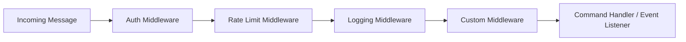

## Core Concepts

This page explains the architectural pillars of `@igniter-js/bot`. Understanding these concepts lets you build complex, production-grade bots with confidence.

---

## The Builder Pattern

The `IgniterBot` builder is the **only recommended way** to construct bots. It provides a fluent, type-safe API where each method narrows the generic type parameters, giving you precise autocomplete at every step.

### Builder Lifecycle

```
IgniterBot.create()
  → .withHandle()        // Set bot identity
  → .withSessionStore()  // Configure session storage
  → .withLogger()        // Structured logging
  → .withOptions()       // Timeouts, retries, etc.
  → .addAdapters()       // Platform adapters (Telegram, WhatsApp, Discord)
  → .addCommands()       // Register commands
  → .addMiddlewares()    // Middleware pipeline
  → .usePlugin()         // Load plugins
  → .onMessage()         // Event listeners
  → .onError()           // Error handling
  → .onStart()           // Startup hooks
  → .onCommand()         // Command execution hooks
  → .build()             // Materialize into immutable Bot instance
```

After `.build()`, the `Bot` instance is **immutable**. All configuration happens through the builder. The bot instance can still dynamically register commands, adapters, and middlewares at runtime using `registerCommand()`, `registerAdapter()`, and `use()`.

### Identity: Handle, ID, and Name

The `withHandle()` method is the primary identity setter. If you don't explicitly set `id` and `name`, they're derived automatically:

```typescript
IgniterBot.create()
  .withHandle('@ecommerce_bot')
  // → id: 'ecommerce_bot'
  // → name: 'Ecommerce Bot'
  .build();
```

You can override them explicitly:

```typescript
IgniterBot.create()
  .withHandle('@ecommerce_bot')
  .withId('prod-ecommerce-v2')
  .withName('E-Commerce Assistant')
  .build();
```

<Callout type="info">
  The handle is used for **mention detection** in group chats. If a global handle is set, all adapters use it. Each adapter can also override the handle in its config.
</Callout>

### Type-Safe Generics

The builder tracks your configuration in its generic parameters:

```typescript
const b1 = IgniterBot.create()
  .addAdapter('telegram', tgAdapter)
// b1: IgniterBotBuilder<{ telegram: TelegramAdapter }, {}, BotContext>

const b2 = b1.addCommand('start', startCmd)
// b2: IgniterBotBuilder<{ telegram: ... }, { start: BotCommand }, BotContext>

const b3 = b2.addMiddleware(authMiddleware)
// b3: IgniterBotBuilder<{ telegram: ... }, { start: ... }, BotContext & AuthContextAdditions>
```

This means TypeScript knows exactly which adapters and commands are available throughout the entire builder chain.

---

## Adapters

Adapters are the bridge between the bot framework and platform-specific APIs. Each adapter:

1. **Parses** incoming requests into a normalized `BotContext`
2. **Declares** its capabilities (supported content types, actions, features, limits)
3. **Provides** send methods for each supported content type
4. **Initializes** by registering webhooks, commands, etc.
5. **Verifies** webhook signatures when applicable

### How Adapters Work

```
HTTP Request → Adapter.verify() (optional signature check)
             → Adapter.handle() → BotContext
             → Bot engine (middlewares, command routing, event listeners)
             → Handler calls ctx.reply() / ctx.sendTyping() / etc.
             → Adapter.sendText() / sendImage() / etc.
             → Platform API
```

### Declared Capabilities

Every adapter declares its capabilities so the framework can validate operations at runtime:

```typescript
const capabilities = {
  content: {
    text: true,        // Can send plain text
    image: true,       // Can send images
    video: true,       // Can send video
    audio: true,       // Can send audio
    document: true,    // Can send files
    sticker: true,     // Can send stickers
    location: true,    // Can share location
    contact: true,     // Can share contacts
    poll: true,        // Can create polls
    interactive: true, // Can send buttons/keyboards
  },
  actions: {
    edit: true,        // Can edit messages
    delete: true,      // Can delete messages
    react: false,      // Can add reactions
    pin: true,         // Can pin messages
    thread: false,     // Has thread support
  },
  features: {
    webhooks: true,    // Supports webhooks
    longPolling: true, // Supports long polling
    commands: true,    // Has native command support
    mentions: true,    // Supports @mentions
    groups: true,      // Supports group chats
    channels: true,    // Supports channels
    users: true,       // Has user management
    files: true,       // Supports file handling
  },
  limits: {
    maxMessageLength: 4096,
    maxFileSize: 50 * 1024 * 1024, // 50MB
    maxButtonsPerMessage: 8,
  },
}
```

If you try to send a poll on WhatsApp (which doesn't support polls), the framework throws a `BotError` with code `CONTENT_TYPE_NOT_SUPPORTED`.

---

## BotContext

The `BotContext` is the normalized representation of every incoming interaction. It's passed to every middleware, command handler, and event listener.

```typescript
interface BotContext {
  // Event type: 'start' | 'message' | 'error'
  event: BotEvent

  // Platform identifier: 'telegram' | 'whatsapp' | 'discord'
  provider: string

  // Bot instance and send capability
  bot: {
    id: string
    name: string
    send: (params) => Promise<void>
    getAdapter?: (provider: string) => IBotAdapter | undefined
    getAdapters?: () => Record<string, IBotAdapter>
  }

  // Channel / chat information
  channel: {
    id: string
    name: string
    isGroup: boolean
  }

  // Message details
  message: {
    id?: string
    content?: BotContent
    attachments?: BotAttachmentContent[]
    author: {
      id: string
      name: string
      username: string
    }
    isMentioned: boolean
  }

  // Session helper for conversational state
  session: BotSessionHelper

  // Convenience reply methods
  reply(content: string | BotOutboundContent, options?: BotSendOptions): Promise<void>
  replyWithButtons(text: string, buttons: BotButton[], options?: BotSendOptions): Promise<void>
  replyWithImage(image: string | File, caption?: string, options?: BotSendOptions): Promise<void>
  replyWithDocument(file: File, caption?: string, options?: BotSendOptions): Promise<void>
  editMessage?(messageId: string, content: BotOutboundContent): Promise<void>
  deleteMessage?(messageId: string): Promise<void>
  react?(emoji: string, messageId?: string): Promise<void>
  sendTyping?(): Promise<void>
}
```

<Callout type="info">
  Methods like `editMessage`, `deleteMessage`, `react`, and `sendTyping` are optional — they're only available when the current adapter supports those actions.
</Callout>

---

## The Middleware Pipeline

Middlewares execute in order for every incoming message. Each middleware receives the context and a `next()` function. Calling `next()` passes control to the next middleware. **Not** calling `next()` stops the pipeline.



### Middleware Signature

```typescript
type Middleware<TContextIn, TContextOut> = (
  ctx: TContextIn,
  next: () => Promise<void>,
) => Promise<void | Partial<TContextOut>>
```

A middleware can:
1. **Enrich the context** by returning an object — merged into the context for downstream handlers
2. **Block the request** by not calling `next()`
3. **Perform side effects** before and after `next()`
4. **Handle errors** with try/catch around `next()`

```typescript
// Context enrichment
builder.addMiddleware(async (ctx, next) => {
  const user = await db.users.findById(ctx.message.author.id);
  await next();
  return { user }; // available in downstream context
});

// Request blocking
builder.addMiddleware(async (ctx, next) => {
  if (ctx.message.author.id === 'blocked_user') {
    await ctx.reply('You are blocked.');
    return; // No next() → pipeline stops
  }
  await next();
});

// Timing middleware
builder.addMiddleware(async (ctx, next) => {
  const start = Date.now();
  await next();
  console.log(`Request took ${Date.now() - start}ms`);
});
```

---

## Plugins

Plugins package commands, middlewares, adapters, and lifecycle hooks into reusable, shareable modules.

```typescript
interface BotPlugin {
  name: string
  version: string
  description?: string
  commands?: Record<string, BotCommand>
  middlewares?: Middleware[]
  adapters?: Record<string, IBotAdapter>
  hooks?: {
    onStart?: () => Promise<void> | void
    onMessage?: (ctx: BotContext) => Promise<void> | void
    onError?: (ctx: BotContext & { error: BotError }) => Promise<void> | void
    onStop?: () => Promise<void> | void
  }
  config?: Record<string, any>
}
```

When a plugin is loaded via `.usePlugin()`, the builder automatically merges its commands, middlewares, adapters, and hooks into the bot configuration. This means you can build a plugin once and reuse it across multiple bots.

---

## Sessions

Sessions persist conversational state across messages. The framework provides:

- A `BotSessionStore` interface for pluggable storage backends
- A built-in `MemorySessionStore` for development
- A `BotSessionHelper` attached to `ctx.session` for easy access in handlers

```typescript
// Session shape
interface BotSession {
  userId: string
  channelId: string
  data: Record<string, any>      // Your application state
  createdAt: Date
  updatedAt: Date
  expiresAt?: Date                // Auto-cleanup on expiration
}

// Helper methods on ctx.session
interface BotSessionHelper extends BotSession {
  save(): Promise<void>                                    // Persist changes
  delete(): Promise<void>                                  // Remove session
  update(data: Partial<Record<string, any>>): Promise<void> // Merge data
}
```

---

## Event System

The bot emits events that you can listen to:

| Event | Trigger | Context Fields |
|-------|---------|---------------|
| `message` | Every incoming message | Full `BotContext` |
| `start` | Bot initialization (`.start()`) | No message data |
| `error` | Any handler throws | `BotContext` + `error: BotError` |

```typescript
// Via builder
builder.onMessage(async (ctx) => { /* ... */ })
builder.onError(async (ctx) => { /* ctx.error */ })
builder.onStart(async () => { /* ... */ })

// Via Bot instance
bot.on('message', async (ctx) => { /* ... */ })
bot.on('error', async (ctx) => { /* ... */ })
```

---

## Error Handling

The framework uses a custom `BotError` class with error codes:

```typescript
const BotErrorCodes = {
  CLIENT_NOT_PROVIDED: 'CLIENT_NOT_PROVIDED',
  PROVIDER_NOT_FOUND: 'PROVIDER_NOT_FOUND',
  COMMAND_NOT_FOUND: 'COMMAND_NOT_FOUND',
  INVALID_COMMAND_PARAMETERS: 'INVALID_COMMAND_PARAMETERS',
  ADAPTER_HANDLE_RETURNED_NULL: 'ADAPTER_HANDLE_RETURNED_NULL',
  CONTENT_TYPE_NOT_SUPPORTED: 'CONTENT_TYPE_NOT_SUPPORTED',
  INVALID_CONTENT: 'INVALID_CONTENT',
}

class BotError extends Error {
  code: BotErrorCode
  meta?: Record<string, unknown>
}
```

Errors can be caught in middleware, event listeners, or the global error handler:

```typescript
builder.onError(async (ctx) => {
  const botError = ctx.error as BotError;
  console.error(`[${botError.code}] ${botError.message}`, botError.meta);
  await ctx.reply('Something went wrong. Our team has been notified.');
});
```

---

## Next Steps

<Cards>
  <Card title="Commands" description="Master aliases, subcommands, and Zod validation." href="/docs/bots/commands" />
  <Card title="Adapters" description="Deep dive into Telegram, WhatsApp, and Discord adapters." href="/docs/bots/adapters" />
  <Card title="Middlewares" description="Auth, rate-limiting, logging, and custom middleware patterns." href="/docs/bots/middlewares" />
</Cards>
