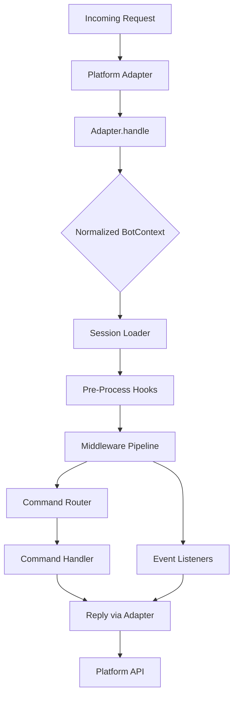

## Overview

`@igniter-js/bot` is a **multi-platform bot framework** for Node.js and Bun. It lets you build conversational bots that run on Telegram, WhatsApp, and Discord simultaneously — sharing commands, middlewares, and session state across all platforms.

You define your bot once using the **builder pattern**, add adapters for each platform, and get a unified API for handling messages, commands, and interactive content — with full TypeScript autocomplete everywhere.

<Callout type="info">
  Bot works with **any platform that can receive HTTP requests**. The adapter pattern means you can write a custom adapter for any chat platform in under 100 lines, and it automatically works with the entire middleware, plugin, and session system.
</Callout>

### Key Features

- **Multi-Platform** — Telegram, WhatsApp, Discord, and custom adapters. One codebase, every chat platform.
- **Fluent Builder API** — `IgniterBot.create().withHandle().addAdapters().addCommand().build()` — fully typed at every step.
- **Command System** — Slash commands with aliases, subcommands, Zod argument validation, and automatic platform registration.
- **Middleware Pipeline** — `auth`, `rateLimit`, `logging` built-in. Extend with custom middleware for any use case.
- **Plugin Architecture** — Package commands, middlewares, adapters, and hooks into reusable plugins.
- **Session Management** — Persistent conversational state with pluggable storage (memory, Redis, Prisma).
- **Rich Content Types** — Send text, images, video, audio, documents, stickers, location, contacts, polls, and interactive buttons.
- **Type-Safe Context** — `BotContext` gives you typed access to message, channel, author, session, and reply helpers.
- **Framework Integration** — Native handlers for Next.js App Router and TanStack Start. Express/Fastify compatible via standard `Request`/`Response`.
- **Adapter Client** — Every adapter exposes a pre-configured HTTP client for making direct API calls when needed.

---

## Architecture

Bot follows the **adapter pattern** — the same pattern used across the Igniter.js ecosystem. The core handles commands, middlewares, sessions, and event routing. Adapters translate between platform-specific APIs and the normalized `BotContext`.



Every incoming message flows through: **adapter parsing → session loading → pre-process hooks → middleware chain → command routing → handler execution → reply dispatch**.

---

## Quick Start

Get a cross-platform bot running in under three minutes.

<Steps>
  <Step>
    ### Install

    <Tabs items={['npm', 'pnpm', 'yarn', 'bun']} groupId="package-manager">
      <Tab value="npm">
        ```bash
        npm install @igniter-js/bot zod
        ```
      </Tab>
      <Tab value="pnpm">
        ```bash
        pnpm add @igniter-js/bot zod
        ```
      </Tab>
      <Tab value="yarn">
        ```bash
        yarn add @igniter-js/bot zod
        ```
      </Tab>
      <Tab value="bun">
        ```bash
        bun add @igniter-js/bot zod
        ```
      </Tab>
    </Tabs>
  </Step>

  <Step>
    ### Create Your Bot

    ```typescript
    import { IgniterBot, telegram, whatsapp, discord, memoryStore } from '@igniter-js/bot';

    const bot = IgniterBot
      .create()
      .withHandle('@my_awesome_bot')
      .withSessionStore(memoryStore())
      .addAdapters({
        telegram: telegram({ token: process.env.TELEGRAM_TOKEN! }),
        whatsapp: whatsapp({
          token: process.env.WHATSAPP_TOKEN!,
          phone: process.env.WHATSAPP_PHONE!,
        }),
        discord: discord({
          token: process.env.DISCORD_TOKEN!,
          applicationId: process.env.DISCORD_APP_ID!,
          publicKey: process.env.DISCORD_PUBLIC_KEY!,
        }),
      })
      .addCommand('start', {
        name: 'start',
        aliases: ['hello', 'hi'],
        description: 'Greets the user',
        help: 'Use /start to receive a welcome message',
        async handle(ctx) {
          await ctx.reply(
            `👋 Hello, ${ctx.message.author.name}! I'm running on ${ctx.provider}.`,
          );
        },
      })
      .addCommand('ping', {
        name: 'ping',
        aliases: [],
        description: 'Check bot responsiveness',
        help: 'Use /ping to check if the bot is alive',
        async handle(ctx) {
          const start = Date.now();
          await ctx.reply('Pong! 🏓');
        },
      })
      .build();

    await bot.start();
    ```

    ✅ **The bot is now running and ready to accept requests.**
  </Step>

  <Step>
    ### Wire Up a Route (Next.js)

    ```typescript
    // app/api/bot/[adapter]/route.ts
    import { nextRouteHandlerAdapter } from '@igniter-js/bot';
    import { bot } from '@/lib/bot';

    export const { GET, POST } = nextRouteHandlerAdapter({
      'my_awesome_bot': bot,
    });
    ```

    Now your bot responds to Telegram webhooks, WhatsApp Cloud API, and Discord interactions — all through a single route.
  </Step>
</Steps>

---

## Core Concepts

<Accordions>
  <Accordion title="Builder Pattern">
    The `IgniterBot` builder is the recommended way to construct bots. It provides a fluent, type-safe API where each method narrows the generic types:

    ```typescript
    const bot = IgniterBot
      .create()                    // Start building
      .withHandle('@bot')          // Set global handle
      .withSessionStore(store)     // Configure session storage
      .withLogger(pino())          // Structured logging
      .addAdapter('telegram', tg)  // Add a platform adapter
      .addCommand('start', cmd)    // Register a command
      .addMiddleware(authMw)       // Add middleware
      .usePlugin(analytics)        // Load a plugin
      .onMessage(messageHandler)   // Listen to events
      .onError(errorHandler)       // Handle errors
      .onStart(startupHook)        // Run on initialization
      .build()                     // Materialize the Bot instance
    ```

    After `.build()`, the bot is immutable. All configuration happens through the builder.
  </Accordion>

  <Accordion title="Adapters">
    Adapters translate between platform-specific APIs and the normalized `BotContext`. Each adapter declares its **capabilities** (supported content types, actions, features, and limits) so the framework can validate operations at runtime.

    **First-party adapters:**
    - **Telegram** — Full support: webhooks, long polling, commands, inline keyboards, all content types
    - **WhatsApp** — Cloud API: text, media, interactive buttons, contacts, location
    - **Discord** — Interactions API: slash commands, buttons, embeds, thread support

    Each adapter provides typed configuration via Zod schemas and supports environment variable defaults.
  </Accordion>

  <Accordion title="Commands">
    Commands are the primary interaction pattern. They support:

    - **Aliases** — `/start`, `/hello`, `/hi` all pointing to the same handler
    - **Subcommands** — Nested command structures (e.g., `/admin ban`, `/admin kick`)
    - **Zod Validation** — Type-safe argument parsing with automatic error messages
    - **Automatic Registration** — Commands are auto-registered with platforms that support it (Telegram bot commands, Discord slash commands)
    - **Command Groups** — Prefix commands logically: `builder.addCommandGroup('admin', { ... })`

    ```typescript
    builder.addCommand('search', {
      name: 'search',
      aliases: ['find', 's'],
      description: 'Search for items',
      help: 'Use /search &lt;query&gt; to find items',
      args: z.object({ query: z.string().min(2) }),
      async handle(ctx, args) {
        const results = await searchDatabase(args.query);
        await ctx.reply(`Found ${results.length} results.`);
      },
    })
    ```
  </Accordion>

  <Accordion title="Middlewares">
    Middlewares execute in sequence for every incoming message. They can enrich the context, block requests, or perform side effects:

    ```typescript
    // Custom middleware
    builder.addMiddleware(async (ctx, next) => {
      console.log(`[${ctx.provider}] ${ctx.message.author.name}: ${ctx.message.content}`);
      const start = Date.now();
      await next(); // Continue to the next middleware or handler
      console.log(`Completed in ${Date.now() - start}ms`);
    })
    ```

    **Built-in middlewares:**
    - `authMiddleware` — User/channel allowlists, blocklists, role-based access
    - `rateLimitMiddleware` — Configurable rate limiting with memory or Redis store
    - `loggingMiddleware` — Structured logging with presets (minimal, standard, verbose, production)
  </Accordion>

  <Accordion title="Plugins">
    Plugins package commands, middlewares, adapters, and lifecycle hooks into reusable modules:

    ```typescript
    // Built-in analytics plugin
    builder.usePlugin(analyticsPlugin({
      trackEvent: async (event, props) => {
        await posthog.capture(event, props);
      },
      trackMessages: true,
      trackCommands: true,
    }))
    ```

    Plugins can also register their own commands (e.g., `/stats` from the analytics plugin), middlewares, and adapters — all composed automatically into the bot.
  </Accordion>

  <Accordion title="Sessions">
    Sessions persist conversational state across messages. The framework provides a `BotSessionStore` interface with a built-in in-memory store and support for custom backends:

    ```typescript
    // In-memory (development)
    builder.withSessionStore(memoryStore())

    // Redis (production)
    builder.withSessionStore(redisStore(redisClient))
    ```

    Access sessions in handlers via `ctx.session`:

    ```typescript
    async handle(ctx) {
      await ctx.session.update({ step: 'awaiting_name' });
      const currentStep = ctx.session.data.step;
    }
    ```
  </Accordion>
</Accordions>

---

## Real-World Use Cases

Bot powers conversational applications across many domains:

| Use Case | Description |
|----------|-------------|
| **Customer Support** | Route inquiries across Telegram, WhatsApp, and Discord with a single codebase |
| **E-commerce Bots** | Product search, order tracking, cart management with interactive buttons |
| **Community Management** | Moderation commands, welcome messages, polls, and announcements |
| **SaaS Onboarding** | Step-by-step guided setup flows with persistent session state |
| **Notification Services** | Push alerts to users on their preferred platform via proactive messaging |
| **Internal Tools** | DevOps bots for deployment status, incident alerts, and team coordination |

---

## Next Steps

<Cards>
  <Card title="Installation" description="Install and configure @igniter-js/bot with the right adapters for your platforms." href="/docs/bots/installation" />
  <Card title="Quick Start" description="Build a production-ready bot in 3 minutes with step-by-step guidance." href="/docs/bots/quick-start" />
  <Card title="Core Concepts" description="Deep dive into the builder, adapters, commands, context, middlewares, and plugins." href="/docs/bots/core-concepts" />
  <Card title="Commands" description="Master the command system with aliases, subcommands, and Zod validation." href="/docs/bots/commands" />
</Cards>
