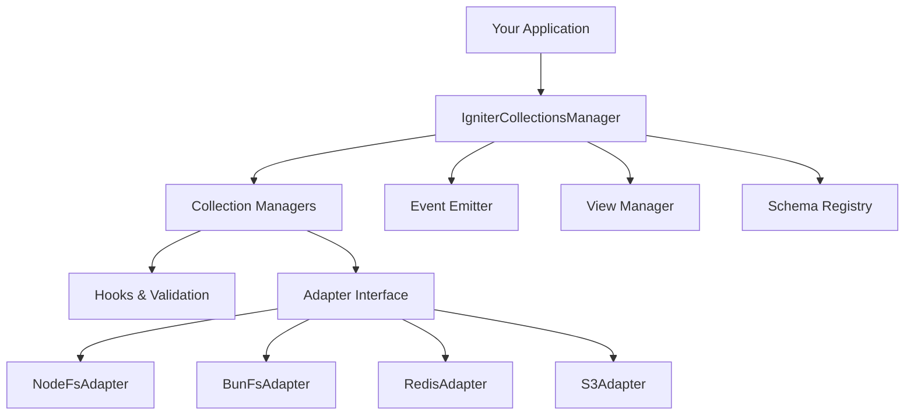

## Overview

`@igniter-js/collections` is a type-safe ORM for content-driven applications. It gives you a **Prisma-like API** for working with Markdown, JSON, and YAML files — with full schema validation, lifecycle hooks, declarative views, and TypeScript autocomplete everywhere.

You define your content schema once using Zod, and collections infers the entire API surface. No code generation. No boilerplate. No surprises.

<Callout type="info">
  Collections works with **any filesystem adapter** — Node.js, Bun, Redis, or S3. The adapter pattern means you develop locally with the filesystem and deploy to distributed storage without changing a single line of collection code.
</Callout>

### Key Features

- **Prisma-like API** — `create`, `findUnique`, `findMany`, `update`, `delete`, `count` with full TypeScript inference
- **Schema Validation** — Zod schemas validate frontmatter at runtime, catching errors before files hit disk
- **Lifecycle Hooks** — `onCreated`, `onUpdated`, `onDeleted`, `onRead`, `onList` with cancel support (return `false`)
- **Rich Querying** — Filter operators (`gte`, `contains`, `has`), dot-notation nested access, full-text search
- **Declarative Views** — Define data hooks, component trees, and actions in pure TypeScript
- **Event System** — Subscribe to global (`created`) or scoped (`posts:updated`) events
- **Auto-Discovery** — Watch directories for `.schema.{ts,json}` and `.view.{ts,json}` files with hot reload
- **Context Injection** — Inject dependencies (DB connections, auth) into every hook and view
- **Multi-Adapter** — Node FS, Bun FS, Redis, S3, or build your own

---

## Architecture

Collections follows the **adapter pattern** — the same pattern used across the Igniter.js ecosystem. The manager layer handles CRUD, hooks, events, and validation. The adapter layer handles reading and writing files.



Every operation flows through the same pipeline: **validate → execute hooks → write/read via adapter → emit events**.

---

## Quick Start

Get a type-safe content collection running in under two minutes.

<Steps>
  <Step>
    ### Install

    <Tabs items={['npm', 'pnpm', 'yarn', 'bun']} groupId="package-manager">
      <Tab value="npm">
        ```bash
        npm install @igniter-js/collections zod
        ```
      </Tab>
      <Tab value="pnpm">
        ```bash
        pnpm add @igniter-js/collections zod
        ```
      </Tab>
      <Tab value="yarn">
        ```bash
        yarn add @igniter-js/collections zod
        ```
      </Tab>
      <Tab value="bun">
        ```bash
        bun add @igniter-js/collections zod
        ```
      </Tab>
    </Tabs>
  </Step>

  <Step>
    ### Define a Collection

    Create a schema and collection definition:

    ```typescript
    import { IgniterCollections, IgniterCollectionModel } from '@igniter-js/collections';
    import { NodeFsAdapter } from '@igniter-js/collections/adapters';
    import { z } from 'zod';

    const Posts = IgniterCollectionModel.create('posts')
      .withPatterns(['.content/posts/{id}.mdx'])
      .withSchema(z.object({
        title: z.string(),
        description: z.string(),
        published: z.boolean().default(false),
        tags: z.array(z.string()).optional(),
        author: z.string(),
      }))
      .build();
    ```
  </Step>

  <Step>
    ### Create the Manager

    Wire everything together with the builder:

    ```typescript
    const docs = IgniterCollections.create()
      .withAdapter(new NodeFsAdapter())
      .withBasePath(process.cwd())
      .addCollection(Posts)
      .build();
    ```
  </Step>

  <Step>
    ### Use It

    ```typescript
    // Create a post
    const post = await docs.posts.create({
      data: {
        title: 'Getting Started with Igniter.js',
        description: 'Learn how to build type-safe content apps',
        published: true,
        tags: ['tutorial', 'typescript'],
        author: 'Felipe Barcelos',
      }
    });

    console.log('Created:', post.id);
    // Created: 9f3e4d2a-8b7c-4e1f-a3d2-9c8b7e6f5a4d

    // Query with full type safety
    const published = await docs.posts.findMany({
      where: { published: true },
      orderBy: { createdAt: 'desc' as const },
    });
    ```
  </Step>
</Steps>

**You now have a type-safe, validated content store.** Every `create`, `update`, and `findMany` call is fully typed — IntelliSense knows your schema fields, and Zod validates every write.

---

## Core Concepts

<Accordions>
  <Accordion title="Collection Definition">
    A **collection** is a named group of documents with a shared schema and file pattern. You define it once using the builder pattern, and collections infers TypeScript types from your Zod schema.

    ```typescript
    const Posts = IgniterCollectionModel.create('posts')
      .withPatterns(['.content/posts/{id}.mdx'])
      .withSchema(z.object({ title: z.string(), published: z.boolean() }))
      .build();
    ```

    The collection name (`posts`) becomes the accessor on the manager (`docs.posts`).
  </Accordion>

  <Accordion title="CRUD Operations">
    Every collection supports the full CRUD surface:

    - **`create(args)`** — Create a document with validated frontmatter
    - **`findUnique(args)`** — Find a single document by ID or criteria
    - **`findMany(args?)`** — Query multiple documents with filters, sorting, and pagination
    - **`update(args)`** — Update document data (partial updates supported)
    - **`delete(args)`** — Delete a document permanently
    - **`count(args?)`** — Count documents matching criteria

    All operations are fully typed — your Zod schema drives the TypeScript inference.
  </Accordion>

  <Accordion title="Lifecycle Hooks">
    Intercept every operation with hooks that can modify, enrich, or cancel the operation:

    ```typescript
    const Posts = IgniterCollectionModel.create('posts')
      .withSchema(postSchema)
      .onCreated(async ({ value }) => {
        await notifySubscribers(value);
        return value; // proceed
      })
      .onUpdated(({ newValue, previousValue }) => {
        if (newValue.data.published && !previousValue.data.published) {
          newValue.data.publishedAt = new Date().toISOString();
        }
        return newValue;
      })
      .build();
    ```

    Return `false` from any hook to cancel the operation.
  </Accordion>

  <Accordion title="Events">
    Subscribe to document lifecycle events globally or scoped to a single collection:

    ```typescript
    // Global events
    const { off } = docs.on('created', ({ collection, value }) => {
      console.log(`Document created in ${collection}: ${value.id}`);
    });

    // Scoped events
    docs.on('posts:updated', ({ newValue, previousValue }) => {
      console.log(`Post ${newValue.id} updated`);
    });
    ```
  </Accordion>

  <Accordion title="Views">
    Define data-driven views with component trees, data hooks, and actions:

    ```typescript
    import { IgniterCollectionView } from '@igniter-js/collections';

    const DashboardView = IgniterCollectionView.create('dashboard')
      .withTitle('Analytics Dashboard')
      .withData(async ({ manager }) => {
        const posts = await manager.posts.findMany();
        return { posts, total: posts.length };
      })
      .withTree([
        { component: 'Metric', valuePath: '/total' },
        { component: 'Table', valuePath: '/posts' },
      ])
      .build();
    ```
  </Accordion>
</Accordions>

---

## Real-World Use Cases

Collections powers content-driven applications across many domains:

| Use Case | Description |
|----------|-------------|
| **Documentation Sites** | Manage docs as Markdown files with validated frontmatter and auto-discovered schemas |
| **Blog Platforms** | Store posts with draft/published workflows via hooks, full-text search, and tag filtering |
| **CMS Backends** | Build headless CMS with collections as the content store and views as the API layer |
| **Configuration Management** | Validate and query config files with type-safe access and change events |
| **E-commerce Catalogs** | Manage product listings with nested sub-collections for variants, reviews, and inventory |
| **Multi-tenant Systems** | Isolate tenant data with adapter routing and context injection for tenant-specific storage |

---

## Next Steps

<Cards>
  <Card title="Installation" description="Set up collections in your project with the right adapter for your runtime." href="/docs/collections/installation" />
  <Card title="Defining Collections" description="Learn schema definition, file patterns, sub-collections, and templates." href="/docs/collections/defining-collections" />
  <Card title="CRUD Operations" description="Master create, read, update, delete, and count with full type safety." href="/docs/collections/crud-operations" />
  <Card title="Querying" description="Filter with operators, sort, paginate, select fields, and full-text search." href="/docs/collections/querying" />
</Cards>
