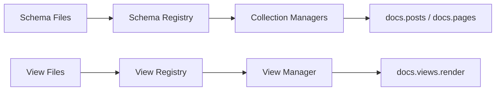

## File Watcher

The watcher auto-discovers collections and views from `.schema` and `.view` files on disk. Configure it once, and collections automatically picks up new schemas and views as you create them — no restart required.

---

## How It Works

1. On `build()`, the watcher scans configured directories for `.schema.{ts,json}` and `.view.{ts,json}` files
2. Discovered schemas become collection managers (alongside programmatic ones)
3. Discovered views are merged with programmatic views
4. If `autoWatch: true`, the watcher monitors for file changes and reloads automatically



---

## Configuration

Enable the watcher on the builder with the directory path and optional configuration:

```typescript
const docs = IgniterCollections.create()
  .withAdapter(new NodeFsAdapter())
  .withBasePath(process.cwd())
  .withWatcher('.fractal', {
    collections: '*.schema.{json,ts}',
    views: '*.view.{json,ts}',
    autoWatch: true, // Enable hot reload
  })
  .addCollection(Posts) // Programmatic collections still work
  .build();
```

### Options

| Option | Type | Default | Description |
|--------|------|---------|-------------|
| `paths` (positional) | `string \| string[]` | required | Directory or directories to scan |
| `collections` | `string` | `"*.schema.{json,ts}"` | Glob pattern for schema files |
| `views` | `string` | `"*.view.{json,ts}"` | Glob pattern for view files |
| `autoWatch` | `boolean` | `false` | Start watching immediately |

### Multiple Directories

```typescript
.withWatcher(['.fractal', '.content/schemas'], {
  autoWatch: true,
})
```

---

## Schema Files

Schema files define collections declaratively. They can be JSON or TypeScript.

### JSON Schema File

```json title=".fractal/posts.schema.json"
{
  "name": "posts",
  "patterns": [".content/posts/{id}.mdx"],
  "schema": {
    "type": "object",
    "properties": {
      "title": { "type": "string" },
      "published": { "type": "boolean", "default": false },
      "tags": { "type": "array", "items": { "type": "string" } },
      "author": { "type": "string" }
    },
    "required": ["title", "author"]
  }
}
```

### TypeScript Schema File

```typescript title=".fractal/posts.schema.ts"
import { z } from 'zod';

export default {
  name: 'posts',
  patterns: ['.content/posts/{id}.mdx'],
  schema: z.object({
    title: z.string(),
    published: z.boolean().default(false),
    tags: z.array(z.string()).optional(),
    author: z.string(),
  }),
};
```

<Callout type="info">
  **TypeScript schemas provide better IntelliSense** and full Zod validation. JSON schemas are compatible with any tool that produces standard JSON Schema.
</Callout>

---

## View Files

Views can also be auto-discovered from `.view` files.

```typescript title=".fractal/dashboard.view.ts"
import type { IgniterCollectionViewDataHook } from '@igniter-js/collections';

export default {
  name: 'dashboard',
  title: 'Analytics Dashboard',
  description: 'Key metrics overview',
  metadata: { icon: 'chart', order: 1 },
  getData: async ({ manager }) => {
    const posts = await manager.posts.findMany();
    return { posts, total: posts.length };
  },
  tree: [
    { component: 'Metric', valuePath: '/total' },
    { component: 'Table', valuePath: '/posts' },
  ],
};
```

---

## Manual Refresh

Call `refresh()` to reload schemas and views from disk on demand:

```typescript
// After creating new schema files programmatically
await docs.refresh();

// New collections are now available
const newPosts = await docs.posts.findMany();
```

<Callout type="info">
  `refresh()` merges discovered schemas with programmatic collections. Programmatic collections **always take precedence** in case of name conflicts.
</Callout>

---

## Watcher Control

Control the watcher at runtime:

```typescript
// Start watching
await docs.watcher.start();

// Check status
console.log(docs.watcher.isWatching); // true

// Stop watching
docs.watcher.stop();

console.log(docs.watcher.isWatching); // false
```

The watcher also exposes its status via `isWatching` (a read-only boolean property).

---

## Conflict Resolution

When a schema or view file has the same name as a programmatic definition, the programmatic version wins:

```typescript
const Posts = IgniterCollectionModel.create('posts')
  .withSchema(programmaticSchema)
  .build();

const docs = IgniterCollections.create()
  .withAdapter(adapter)
  .withWatcher('.fractal') // May also discover 'posts' schema
  .addCollection(Posts)    // Programmatic 'posts' takes precedence
  .build();
```

A warning is logged when conflicts occur: `View conflict: programmatic view "dashboard" overrides watched view`.

---

## Real-World Example: Plugins System

Use the watcher to build a plugin system where third-party code can register new content types:

```typescript
// Core app bootstrapping
const docs = IgniterCollections.create()
  .withAdapter(new NodeFsAdapter())
  .withBasePath(process.cwd())
  .withWatcher('.fractal/plugins', {
    collections: '**/*.schema.ts',
    views: '**/*.view.ts',
    autoWatch: true,
  })
  .addCollection(CorePosts)   // Built-in collections
  .addCollection(CorePages)
  .build();

// Third-party plugin: .fractal/plugins/events/events.schema.ts
export default {
  name: 'events',
  patterns: ['.content/events/{id}.mdx'],
  schema: z.object({
    name: z.string(),
    date: z.string(),
    location: z.string(),
  }),
};

// Now accessible without any code changes
const events = await docs.events.findMany();
```

---

## Next Steps

<Cards>
  <Card title="Advanced" description="Context injection, telemetry, global hooks, and multi-pattern." href="/docs/collections/advanced" />
  <Card title="API Reference" description="Complete reference for all builders, managers, and types." href="/docs/collections/api-reference" />
  <Card title="Best Practices" description="Patterns, anti-patterns, and performance tips." href="/docs/collections/best-practices" />
</Cards>
