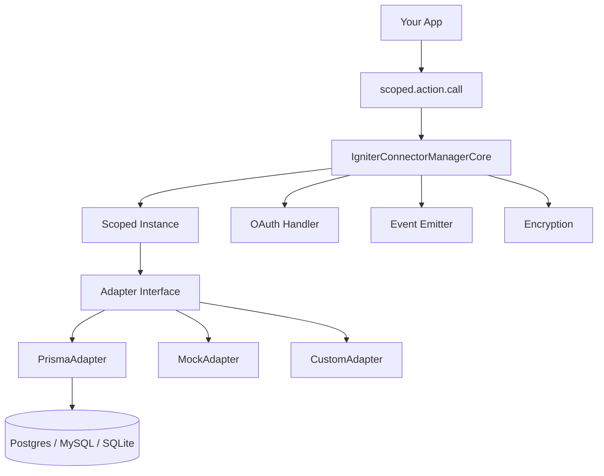

## Overview

`@igniter-js/connectors` is a **standalone, builder-based** connector management library for TypeScript applications. It provides a unified, type-safe interface for defining, connecting, and executing actions on third-party integrations — backed by a pluggable adapter architecture.

Whether you need to send Telegram messages, connect to Mailchimp via OAuth, receive Stripe webhooks, or manage hundreds of API integrations across thousands of tenants — connectors gives you the foundation with full TypeScript inference everywhere.

<Callout type="info">
  Connectors is a **fully independent package**. You can use it in any Node.js or Bun application — Express, Next.js, Fastify, Hono, or a background worker. No framework lock-in.
</Callout>

### Key Features

- **Type-safe connectors** — Define config schemas (Zod), action signatures, and get full type inference on scoped instances
- **Multi-tenant scopes** — Isolate integrations per organization, user, workspace, or any custom dimension
- **OAuth 2.0 with PKCE** — Full OAuth lifecycle: authorization, callback, token refresh, and user info fetching
- **AES-256-GCM encryption** — Sensitive fields (API keys, tokens) encrypted at rest with `IGNITER_SECRET`
- **Webhook pipelines** — Define, verify, validate, and handle incoming webhooks with schema validation
- **Adapter system** — Prisma adapter for PostgreSQL/MySQL/SQLite, mock adapter for testing, or build your own
- **Event-driven** — Subscribe to connector lifecycle, action execution, OAuth, and webhook events
- **Telemetry-ready** — Structured observability events with redaction rules for safe production monitoring
- **Predictable errors** — Stable error codes (`CONNECTOR_NOT_FOUND`, `CONNECTOR_ACTION_INPUT_INVALID`) for programmatic handling

---

## Architecture

Connectors follows the **adapter pattern** — the same pattern used across the Igniter.js ecosystem. The manager layer handles scoping, actions, OAuth, events, and encryption. The adapter layer handles persistence.



Every operation flows through the same pipeline: **validate → encrypt → persist via adapter → emit events**.

### Mental Model

| Concept | What it is | Example |
|---------|-----------|---------|
| **Connector Definition** | Schema + actions + OAuth + webhook config | `IgniterConnector.create().withConfig(...).addAction(...).build()` |
| **Manager** | Wires adapters, encryption, telemetry, scopes | `IgniterConnectorManager.create().withDatabase(...).build()` |
| **Scoped Instance** | Per-tenant operations (connect, action, list) | `connectors.scope('organization', 'org_123')` |
| **Adapter** | Database persistence layer | `IgniterConnectorPrismaAdapter.create(prisma)` |
| **Telemetry** | Structured observability events | `IgniterConnectorsTelemetryEvents` |

---

## Quick Start

Get a multi-tenant Telegram connector running in under two minutes.

<Steps>
  <Step>
    ### Install

    <Tabs items={['npm', 'pnpm', 'yarn', 'bun']} groupId="package-manager">
      <Tab value="npm">
        ```bash
        npm install @igniter-js/connectors @igniter-js/common zod
        ```
      </Tab>
      <Tab value="pnpm">
        ```bash
        pnpm add @igniter-js/connectors @igniter-js/common zod
        ```
      </Tab>
      <Tab value="yarn">
        ```bash
        yarn add @igniter-js/connectors @igniter-js/common zod
        ```
      </Tab>
      <Tab value="bun">
        ```bash
        bun add @igniter-js/connectors @igniter-js/common zod
        ```
      </Tab>
    </Tabs>
  </Step>

  <Step>
    ### Define a Connector

    ```typescript
    import { IgniterConnector } from "@igniter-js/connectors";
    import { z } from "zod";

    const telegram = IgniterConnector.create()
      .withConfig(
        z.object({
          botToken: z.string(),
          chatId: z.string(),
        }),
      )
      .addAction("sendMessage", {
        input: z.object({ message: z.string() }),
        output: z.object({ messageId: z.string() }),
        handler: async ({ input, config }) => {
          const res = await fetch(
            `https://api.telegram.org/bot${config.botToken}/sendMessage`,
            {
              method: "POST",
              headers: { "Content-Type": "application/json" },
              body: JSON.stringify({ chat_id: config.chatId, text: input.message }),
            },
          );
          const data = await res.json();
          return { messageId: String(data.result.message_id) };
        },
      })
      .build();
    ```
  </Step>

  <Step>
    ### Create the Manager

    ```typescript
    import { IgniterConnectorManager } from "@igniter-js/connectors";
    import { IgniterConnectorPrismaAdapter } from "@igniter-js/connectors/adapters";

    const connectors = IgniterConnectorManager.create()
      .withDatabase(IgniterConnectorPrismaAdapter.create(prisma))
      .withEncrypt(["botToken"])
      .addScope("organization", { required: true })
      .addConnector("telegram", telegram)
      .build();
    ```
  </Step>

  <Step>
    ### Connect and Execute

    ```typescript
    const scoped = connectors.scope("organization", "org_123");

    await scoped.connect("telegram", {
      botToken: "123456:ABC-DEF1234",
      chatId: "-1001234567890",
    });

    const { data, error } = await scoped
      .action("telegram", "sendMessage")
      .call({ message: "Hello from Igniter.js" });

    if (error) throw error;
    console.log("Message ID:", data?.messageId);
    ```
  </Step>
</Steps>

**✅ Success!** You've created a multi-tenant connector with encrypted config, typed actions, and scoped access.

---

## Next Steps

- [Installation](/docs/connectors/installation) — All package managers and peer dependencies
- [Getting Started](/docs/connectors/getting-started) — Complete walkthrough with a real integration
- [Defining Connectors](/docs/connectors/defining-connectors) — Config schemas, metadata, actions in depth
- [Manager Setup](/docs/connectors/manager-setup) — Adapters, encryption, telemetry, scopes
