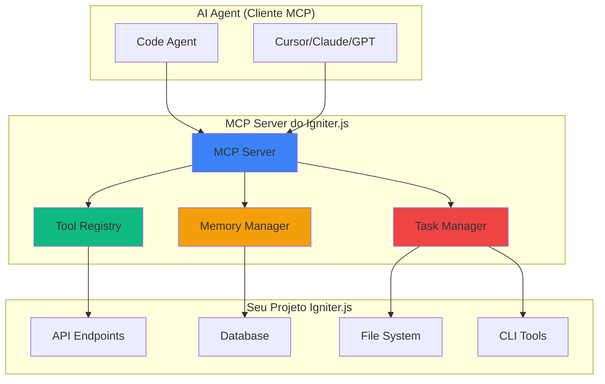

# MCP Server do Igniter.js

O **MCP Server do Igniter.js** é uma implementação completa do Model Context Protocol (MCP) que transforma seu projeto Igniter.js em um servidor de ferramentas para AI Agents. Ele permite que Code Agents como Cursor, Claude Code, VS Code Copilot e outros acessem e utilizem seu projeto através de uma interface padronizada e segura.

## O que é o MCP Server?

O **Model Context Protocol (MCP)** é um protocolo aberto que padroniza como aplicações fornecem contexto para Large Language Models (LLMs). Pense no MCP como uma porta USB-C para aplicações de IA - assim como o USB-C fornece uma maneira padronizada de conectar seus dispositivos a vários periféricos, o MCP fornece uma maneira padronizada de conectar modelos de IA a diferentes fontes de dados e ferramentas.

### Por que usar o MCP Server?

- **🤖 AI-Native**: Seu projeto se torna nativamente compatível com AI Agents
- **🔧 Ferramentas Padronizadas**: Todas as funcionalidades são expostas como ferramentas MCP padronizadas
- **🔄 Integração Universal**: Funciona com qualquer cliente MCP compatível
- **🛡️ Seguro**: Execução isolada e controle granular sobre permissões
- **📚 Contexto Rico**: Fornece acesso completo ao seu projeto e código

## Arquitetura do MCP Server



## Ferramentas Disponibilizadas

O MCP Server do Igniter.js expõe uma ampla gama de ferramentas organizadas em categorias:

### 🛠️ Ferramentas de Desenvolvimento

- **CLI Tools**: Execução de comandos `igniter dev`, `igniter build`, `igniter test`
- **Build & Test**: Compilação, testes e validação do projeto
- **File Analysis**: Análise de estrutura de arquivos e código TypeScript

### 🔍 Ferramentas de Investigação

- **Code Investigation**: Busca de implementações, símbolos e dependências
- **API Validation**: Teste de endpoints e validação de especificações OpenAPI
- **Documentation Access**: Acesso a documentação externa e interna

### 📚 Ferramentas de Memória e Conhecimento

- **Memory Management**: Sistema de memória baseado em MDX para persistência de conhecimento
- **Task Management**: Gerenciamento completo de tarefas e projetos
- **Relationship Mapping**: Mapeamento de relacionamentos entre diferentes tipos de memória

### 🤖 Ferramentas de Delegação de Agentes

- **Agent Delegation**: Delegação de tarefas para agentes especializados
- **Background Execution**: Execução em background com monitoramento
- **Multi-Agent Support**: Suporte para Claude, Gemini, GPT e agentes customizados

### 🔗 Integração com GitHub

- **Issue Management**: Criação e busca de issues do GitHub
- **Code Search**: Busca de código em repositórios
- **Repository Integration**: Integração completa com o ecossistema GitHub

## Como Funciona

### 1. Descoberta de Ferramentas

O cliente MCP descobre automaticamente todas as ferramentas disponíveis:

```json
{
  "method": "tools/list",
  "params": {},
  "result": {
    "tools": [
      {
        "name": "analyze_file",
        "title": "Analyze File",
        "description": "Analyzes the structure, imports, exports, functions, and TypeScript errors of a file.",
        "inputSchema": {
          "filePath": "string",
          "includeErrors": "boolean",
          "projectRoot": "string?"
        }
      }
    ]
  }
}
```

### 2. Execução de Ferramentas

O cliente pode executar qualquer ferramenta disponível:

```json
{
  "method": "tools/call",
  "params": {
    "name": "analyze_file",
    "arguments": {
      "filePath": "src/features/user-management/controller.ts",
      "includeErrors": true
    }
  }
}
```

### 3. Resposta Estruturada

A ferramenta retorna resultados estruturados e acionáveis:

```json
{
  "result": {
    "content": [
      {
        "type": "text",
        "text": "File analysis complete: 0 errors, 2 warnings, healthy status"
      }
    ]
  }
}
```

## Configuração

### Instalação

O MCP Server já está incluído em todos os starters oficiais do Igniter.js. Para projetos existentes:

```bash
npm install @igniter-js/mcp-server
```

### Configuração Básica

```typescript
// src/igniter.ts
import { createMcpServer } from '@igniter-js/mcp-server';

export const igniter = Igniter
  .context<IgniterAppContext>()
  // ... outras configurações
  .mcp(createMcpServer({
    // Configurações do MCP Server
    enableMemoryManager: true,
    enableTaskManager: true,
    enableAgentDelegation: true
  }))
  .build();
```

### Variáveis de Ambiente

```bash
# Para agentes de delegação
ANTHROPIC_API_KEY=your_claude_key
GOOGLE_API_KEY=your_gemini_key
OPENAI_API_KEY=your_gpt_key

# Para integração GitHub
GITHUB_TOKEN=your_github_token
```

## Casos de Uso

### 🎯 Desenvolvimento Assistido por IA

```typescript
// O AI Agent pode analisar seu código automaticamente
analyze_feature({
  featurePath: "src/features/user-management",
  includeStats: true
})

// E sugerir melhorias baseadas na análise
```

### 🔄 Gerenciamento de Tarefas

```typescript
// Criar tarefas automaticamente
create_task({
  title: "Implementar validação de email",
  content: "Adicionar validação Zod para emails",
  priority: "high",
  assignee: "agent"
})

// Delegar para agentes especializados
delegate_to_agent({
  task_id: "task-123",
  agent_type: "claude",
  execution_mode: "background"
})
```

### 📊 Análise de Projeto

```typescript
// Obter estatísticas completas do projeto
get_task_statistics({
  include_delegation_insights: true
})

// Encontrar candidatos para delegação
find_delegation_candidates({
  complexity_threshold: "medium",
  max_estimated_hours: 8
})
```

## Integração com Code Agents

### Cursor

```json
// .cursor/rules/igniter-mcp.mdc
---
alwaysApply: true
---
# Igniter.js MCP Server Expert

Este projeto usa o MCP Server do Igniter.js. Use as ferramentas MCP disponíveis para:
- Analisar código e estrutura do projeto
- Gerenciar tarefas e delegações
- Executar comandos CLI
- Investigar dependências e implementações

Sempre use as ferramentas MCP apropriadas em vez de tentar acessar o projeto diretamente.
```

### Claude Code

```json
// .cursorrules
Você é um especialista em Igniter.js com acesso ao MCP Server. Use as ferramentas disponíveis para:
1. Analisar código e estrutura
2. Gerenciar tarefas e projetos
3. Executar comandos e validações
4. Investigar dependências

Sempre prefira usar as ferramentas MCP sobre acesso direto ao código.
```

### VS Code Copilot

```json
// .github/copilot/README.md
Este projeto integra com o MCP Server do Igniter.js. O Copilot pode:
- Usar ferramentas de análise de código
- Acessar o sistema de gerenciamento de tarefas
- Executar comandos CLI do projeto
- Investigar estrutura e dependências
```

## Monitoramento e Debugging

### Verificar Status do Servidor

```typescript
// Verificar ambiente dos agentes
check_agent_environment({
  check_docker: true,
  check_api_keys: true,
  detailed_report: true
})
```

### Monitorar Execuções

```typescript
// Listar delegações ativas
list_active_delegations({
  include_recent: true,
  max_results: 20
})

// Verificar status específico
check_delegation_status({
  task_id: "task-123"
})
```

### Logs e Analytics

```typescript
// Monitorar tarefas dos agentes
monitor_agent_tasks({
  agent_type: "all",
  include_logs: true,
  include_analytics: true
})
```

## Próximos Passos

1. **Explore as Ferramentas**: Use `tools/list` para descobrir todas as funcionalidades disponíveis
2. **Configure seu Ambiente**: Configure as variáveis de ambiente necessárias
3. **Teste a Integração**: Conecte seu Code Agent favorito ao MCP Server
4. **Personalize**: Ajuste as configurações para suas necessidades específicas

## Recursos Adicionais

- [Documentação Oficial do MCP](https://modelcontextprotocol.io/)
- [Especificação do Protocolo](https://modelcontextprotocol.io/specification/latest)
- [Exemplos de Implementação](https://github.com/modelcontextprotocol/servers)
- [Comunidade MCP](https://modelcontextprotocol.io/community)

---

O MCP Server do Igniter.js transforma seu projeto em uma plataforma verdadeiramente AI-native, permitindo que Code Agents trabalhem com seu código de forma inteligente e eficiente. Comece explorando as ferramentas disponíveis e descubra como a IA pode acelerar seu desenvolvimento!

